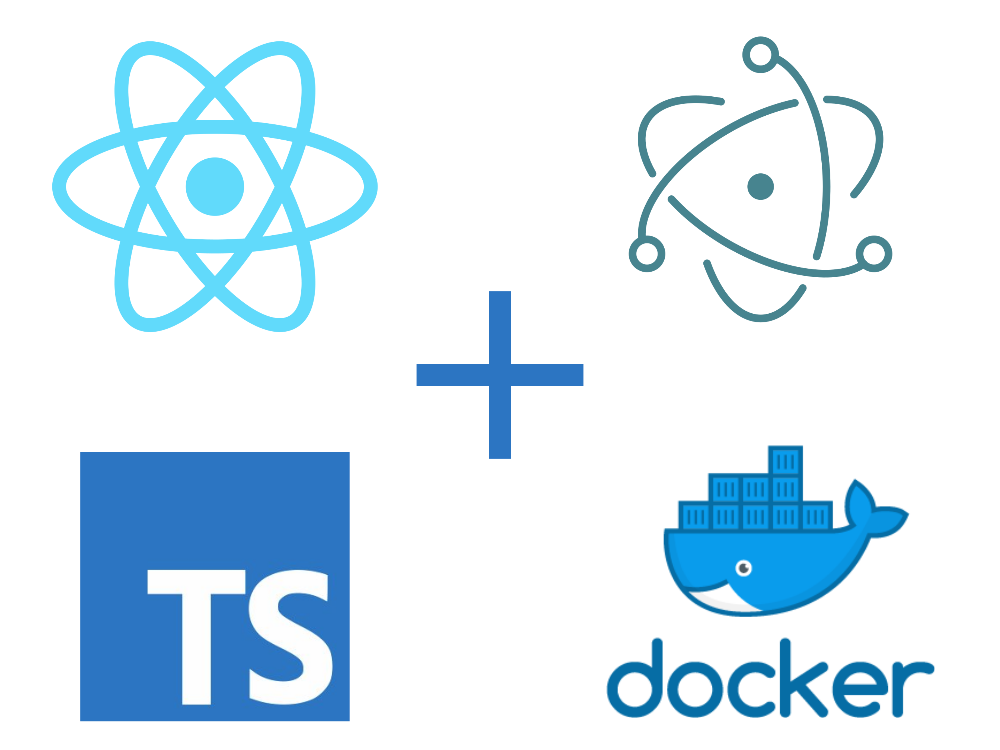

</img>

# electron-react-typescript-docker

</img>

This project is for developing React apps inside of a Docker container using TypeScript. 

## Getting Started

**On first run**:

`make npm-update`

This will setup the node_modules directory for you.

**On subsequent runs**:

`make run-dev`

This will run the react app on the internal port 3000 then start Electron.

There is a slight lag between the react app being ready and electron firing up, so if electron opens with a blank window simply refresh the browser. 

## Using the container

The container performs the following mount:

`-v $pwd/app:/app`

However, you can simply run the container and mount your own project folder and just use the container as a development host. 

`make run-dev -e PROJECT_FOLDER=<insert_your_project_folder_here>`

Or if you just want to use the docker container without pulling this repo:

First run:

`xhost +local:docker`

then:

`docker run -ti --rm -v tmp/.X11-unix:/tmp/.X11-unix -v $(PROJECT_FOLDER) -w /app -e DISPLAY=$$DISPLAY  dlemphers/electron-react-docker npm run dev
`

`$(PROJECT_FOLDER)` is the location to your Electron project.

## Things you should know

This passes the X11 display handle to the container so the container process for Electron is rendered on your machine. This currently only works on Linux.

For non-Linux users:

### Windows

TBD

### Mac

See this [issue comment](https://github.com/moby/moby/issues/8710#issuecomment-315397071) for some hints 